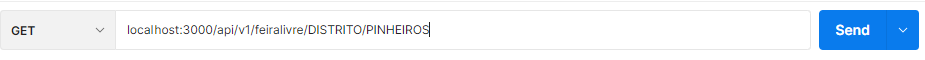
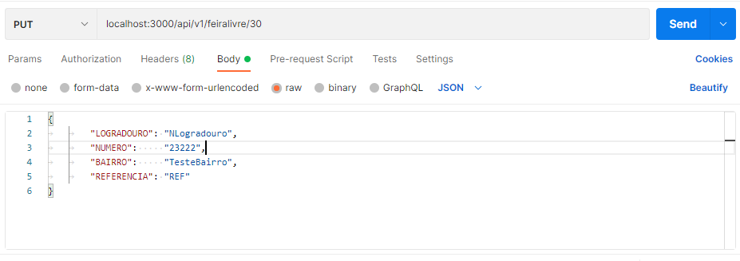
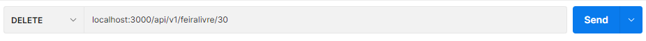
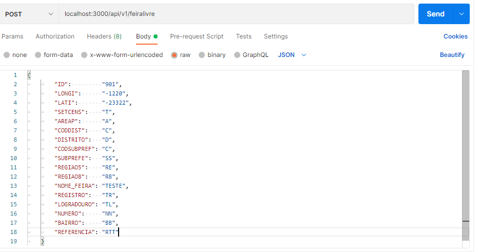

# avunico

Microserviço que disponbiliza acesso a dados referentes a Localização de Feiras Livres do Município de São Paulo. A Aplicação foi desenvolvida, obedecendo o protocolo Rest. Todos as operações são executadas obedecendo os Verbos HTML. E quando é necessário a inclusão de informação, é utilizado em formato JSON. 

## Configurando alguns recursos
### Base de Dados

O Banco de Dados utilizado aqui é o MariaDB e as informações pertinentes a tabela que irá conter os dados para o funcionamento do microserviço. Foi extraído do arquivo http://www.prefeitura.sp.gov.br/cidade/secretarias/upload/chamadas/feiras_livres_1429113213.zip, disponibilizado pela Prefeitura de São Paulo.

#### Criação da Base de Dados

```
CREATE DATABASE `avunico` 
```
#### Criação da Tabela

👉  ***Importante:***
As colunas NUMERO, BAIRRO E REFERENCIA não estão com o mesmo tamanho de varchar em relação ao que esta definido no dicionário. Para realização da carga do CSV para evitar o erro de ***Data truncated for column*** eu defini um novo tamanho
____

```
CREATE TABLE `feiraslivres` (
	`ID` VARCHAR(8) NOT NULL COMMENT 'Número de identificação do estabelecimento georreferenciado por SMDU/Deinfo,SMDU/Deinfo',
        `LONGI` VARCHAR(10) NOT NULL COMMENT 'Longitude da localização do estabelecimento no território do Município, conforme MDC',
	`LATI` VARCHAR(10) NOT NULL COMMENT 'Latitude da localização do estabelecimento no território do Município, conforme MDC',
	`SETCENS` VARCHAR(15)  COMMENT 'Setor censitário,Setor censitário conforme IBGE',
	`AREAP` VARCHAR(13)  COMMENT 'Área de ponderação (agrupamento de setores censitários) conforme IBGE 2010',
	`CODDIST` VARCHAR(9) COMMENT 'Código do Distrito Municipal conforme IBGE',
	`DISTRITO`VARCHAR(18) COMMENT 'Nome do Distrito Municipal',
	`CODSUBPREF` VARCHAR(2) COMMENT 'Código de cada uma das 31 Subprefeituras (2003 a 2012)',
	`SUBPREFE` VARCHAR(25) COMMENT 'Nome da Subprefeitura (31 de 2003 até 2012)',
	`REGIAO5` VARCHAR(6)  COMMENT 'Região conforme divisão do Município em 5 áreas',
	`REGIAO8` VARCHAR(7)  COMMENT 'Região conforme divisão do Município em 8 áreas',
	`NOME_FEIRA` VARCHAR(30)  COMMENT 'Denominação da feira livre atribuída pela Supervisão de Abastecimento',
	`REGISTRO` VARCHAR(6) COMMENT 'Número do registro da feira livre na PMSP',
	`LOGRADOURO` VARCHAR(34) COMMENT 'Nome do logradouro onde se localiza a feira livre',
	`NUMERO` VARCHAR(20) COMMENT 'Um número do logradouro onde se localiza a feira livre',
	`BAIRRO` VARCHAR(30)  COMMENT 'Bairro de localização da feira livre',	
	`REFERENCIA` VARCHAR(40)  COMMENT 'Ponto de referência da localização da feira livre',
	PRIMARY KEY (`ID`)
)
COMMENT='Contém os os dados das feiras livres do Município de São Paulo'
COLLATE='latin1_swedish_ci'
```
#### Carga do CSV para a tabela na feiraslivres da base avunico

👉  ***Importante:***
No meu ambiente eu usei esse dir C:/CargaFeiraLivre/ para manter o arquivo DEINFO_AB_FEIRASLIVRES_2014.csv, conteúdo do feiras_livres_1429113213.zip. Essa configuração é da escolha do usuário.
___

```
LOAD DATA LOCAL INFILE 'C:/CargaFeiraLivre/DEINFO_AB_FEIRASLIVRES_2014.csv'
INTO TABLE feiraslivres
FIELDS TERMINATED BY ','
    ENCLOSED BY '"'
LINES TERMINATED BY '\n'
IGNORE 1 LINES
(ID,LONGI,LATI,SETCENS,AREAP,CODDIST,DISTRITO,CODSUBPREF,SUBPREFE,REGIAO5,REGIAO8,NOME_FEIRA,REGISTRO,LOGRADOURO,NUMERO,BAIRRO,REFERENCIA)
```

#### Variaveis de Ambiente

Os dados necessários para acesso ao banco de dados na minha configuração são mantidos como Variaveis de Ambiente do Sistema Operacional. Acredito que essa seja uma boa prática. No entanto fica a critério do usuário essa configuração.

*** As variaveis são as seguintes ***

```
strHostPort := os.Getenv("AVUNICO_HOST_PORT")
strUsuario := os.Getenv("AVUNICO_USUARIO")
strPass := os.Getenv("AVUNICO_PASSWORD")
strDbName := os.Getenv("AVUNICO_DB_NAME")

```

#### Dependências 

Para se conectar a base de dados e realizar as transações foi utilizado o pacote abaixo

```
go get -u github.com/go-sql-driver/mysql

```

#### Rodando a aplicação

Após todas as configurações e inclusão dos dados na base. Utilize uma aplicação de sua preferência para fazer as chamadas aos serviços. Eu utilizo o Postman nos meus testes.

###  Realizando as chamadas



```
Método GET

localhost:3000/api/v1/feiralivre/DISTRITO/PINHEIROS

```
____



```
Método PUT

localhost:3000/api/v1/feiralivre/30

{
		"LOGRADOURO": "NLogradouro",
		"NUMERO":     "23222",
		"BAIRRO":     "TesteBairro",
		"REFERENCIA": "REF"
}

```
_____



```
Método DELETE

localhost:3000/api/v1/feiralivre/30

```
_______




```
Método Post

{
		ID:         "901",
		LONGI:      "-1220",
		LATI:       "-23322",
		SETCENS:    "T",
		AREAP:      "A",
		CODDIST:    "C",
		DISTRITO:   "D",
		CODSUBPREF: "C",
		SUBPREFE:   "SS",
		REGIAO5:    "RE",
		REGIAO8:    "R8",
		NOME_FEIRA: "TESTE",
		REGISTRO:   "TR",
		LOGRADOURO: "TL",
		NUMERO:     "NN",
		BAIRRO:     "BB",
		REFERENCIA: "RTT",
	}

```
_____

#### Teste Unitário

Alguns arquivos estão com corbetura de teste. Não contemplei todos os arquivos, pois é um assunto que preciso obter mais conhecimento


## Comando com output no cmd

```
go test -cover ./...
?       avunico [no test files]
ok      avunico/avDb    (cached)        coverage: 29.3% of statements
ok      avunico/avServer        (cached)        coverage: 7.1% of statements
ok      avunico/avlog   1.637s  coverage: 55.3% of statements
?       avunico/avmodels        [no test files]

```
____

## Comando com relatório

O comando abaixo gera um relatório de saída. Mas sua visualização não é muito amigavel. A seguir um comando que executa um Html com os dados do coverage.out

```
go test -coverprofile=coverage.out ./...

```
___

## Comando para abrir o relatório para verificação da cobertura

O comando abaixo executa o browser da sua maquina exibindo as func que não passaram pelo teste

```
go tool cover -html=coverage.out

```
